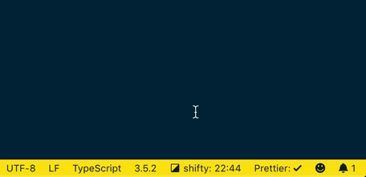

## Highlights

- [Shifts color theme & font family every 30 minutes](#shift-interval)
- [Favorites/ignores color themes & font families](#) <!-- TODO: Link somewhere -->
- [Cross-platform automatic monospace font detection](#automatic-monospace-font-detection)
- [Syncs the current color theme with your Hue smart lights](#hue-smart-light-integration)
- [Displays the remaining time until your next shift in the status bar](#shift-interval)
- [Highly configurable](#settings)

<!-- TODO: https://code.visualstudio.com/updates/v1_59#_rich-status-bar-hover -->
<!-- TODO: https://code.visualstudio.com/updates/v1_58#_settings-editor -->
<!-- TODO: https://code.visualstudio.com/updates/v1_57#_status-bar-item-id-and-name-properties -->

<!-- TODO: Record new gif -->

## Get started

1. [Install shifty](https://marketplace.visualstudio.com/search?term=shifty&target=VSCode&category=All%20categories&sortBy=Relevance)
2. [Understand & configure shift mode](#shift-mode)
3. [Favorite and ignore color themes & font families](#) <!-- TODO: Link somewhere -->

> To experience shifty in it's full glory, optionally install your favorite [VS Code themes](https://marketplace.visualstudio.com/search?target=VSCode&category=Themes&sortBy=Installs) and [codeface fonts](https://github.com/chrissimpkins/codeface).

### Explore advanced capabilities

* [Learn more about the shift interval ›](#shift-interval)
* [Learn more about automatic monospace font detection ›](#automatic-monospace-font-detection)
* [Learn more about Hue smart light integration ›](#hue-smart-light-integration)

## Shift mode

Shifty supports three different shift modes when cycling through color themes & font families. We recommend using **[discovery mode](#discovery)**, although this is not the default due to a potentially jarring experience for uneducated users.

[Learn more about discovery mode ›](#discovery)

### default

Cycles through all color themes & font families that have not been ignored.

### discovery

Cycles through color themes & font families that have not been favorited or ignored. When all color themes or font families have been _**discovered**_ (favorited or ignored), shifty will automatically fallback to [favorites mode](#favorites). Installing new color themes or font families will trigger shifty to cycle through those until everything has been _**discovered**_ again.

### favorites

TODO
Cycles through favorite color themes & font families. Respects `ignoreDarkColorThemes`, `ignoreHighContrastColorThemes`, and `ignoreLightColorThemes` settings to allow cycling through specific sets of favorite color themes.

## Shift interval

The shift interval is the bread & butter of shifty. It will start automatically and display the remaining time in the status bar. You can pause the shift interval by opening the command palette (`⇧⌘P`) and typing `shifty pause` or [disable the automatic startup feature](#automaticallystartshiftinterval) in settings. By default, shifty will shift your color theme & font family every **30 minutes**, although you can configure the interval to satisfy your preferences.

[Learn more about shift interval settings ›](#shiftcolorthemeintervalmin)

## Automatic monospace font detection

<!-- TODO: Write content -->
<!-- only allow fonts installed on the system to be used. You may use shifty across platforms and have platform specific fonts favorited. -->

## Hue smart light integration

<!-- TODO: Write content -->

## Commands

<!-- TODO: ensure favorite/unfavorite font family is tested and working -->
<!-- TODO: ensure favorite/unfavorite color theme is tested and working -->

All shifty features have commands associated with them. Open the VS Code command palette (`⇧⌘P`) and type `shifty` to see the list of commands available to you.

- Shift – _shifts your color theme & font family_
- Shift color theme – _shifts your color theme_
- Shift font family – _shifts your font family_
- Favorite color theme – _adds the current color theme to you favorites_
- Unfavorite color theme – _removes the current color theme from your favorites_
- Ignore color theme - _ignores & unfavorites the current color theme_
- Favorite font family – _adds the current font family to your favoties_
- Unfavorite font family – _removes the current font family from your favorites_
- Ignore font family - _ignores & unfavorites the current font family_
- Start shift interval – _starts the shift interval_
- Pause shift interval – _pauses the shift interval_
- Restart shift interval – _restarts the shift interval timer_
- Show status – _displays your current color theme & font family_

## Settings

### shiftMode

> Default value: `default`

Controls how shifty cycles through color themes & font families.

---

### favoriteColorThemes

> Default value: `[]`

List of color themes you've favorited.

---

### ignoreColorThemes

> Default value: `[]`

List of color themes you've ignored.

---

### favoriteFontFamilies

> Default value: `[]`

List of font families you've favorited.

---

### ignoreFontFamilies

> Default value: `[]`

List of font families you've ignored.

---

### includeFontFamilies

> Default value: `[]`

List of missing font families to include. Useful for including fonts that are not automatically detected.

---

### fallbackFontFamily

> Default value: `monospace`

Controls which font family to use as the fallback. Supports comma-delimited values. (e.g. `"Fira Code", monospace`)

---

### shiftColorThemeIntervalMin

> Default value: `30`

The number of minutes to wait before shifting the color theme. Use `0` or `null` to disable the color theme shift interval.

---

### shiftFontFamilyIntervalMin

> Default value: `30`

The number of minutes to wait before shifting the font family. Use `0` or `null` to disable the font family shift interval.

---

### automaticallyStartShiftInterval

> Default value: `true`

Controls whether the shift interval will start automatically.

## FAQ

<!-- TODO: Write up FAQ -->

### How does discovery mode work?

### Can I use shifty with multiple instances of VS Code running?

### How do I fonts that I've purchased?

### A monospace font on my system is not detected. How do I get shifty to recognize it?

## Contributing

1. [Fork](https://help.github.com/en/articles/fork-a-repo) this repository to your own GitHub account and then [clone](https://help.github.com/en/articles/cloning-a-repository) it to your local device
1. Install the dependencies using `yarn`
1. Use VS Code launch configurations to debug or run integration tests
   - **Run Extension** - runs the extension from source with debugging enabled
   - **Extension Tests** - runs the integration test suite
1. Make sure to docuemnt changes in `CHANGELOG.md`

## License

MIT
